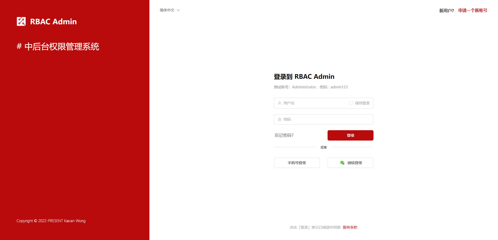
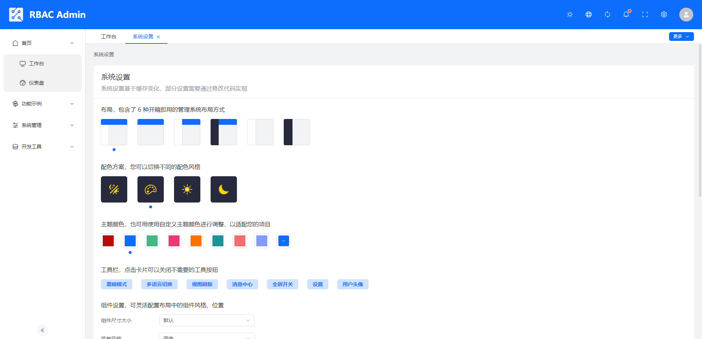
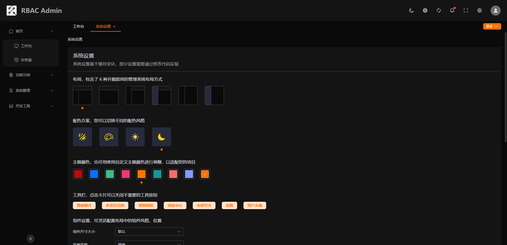
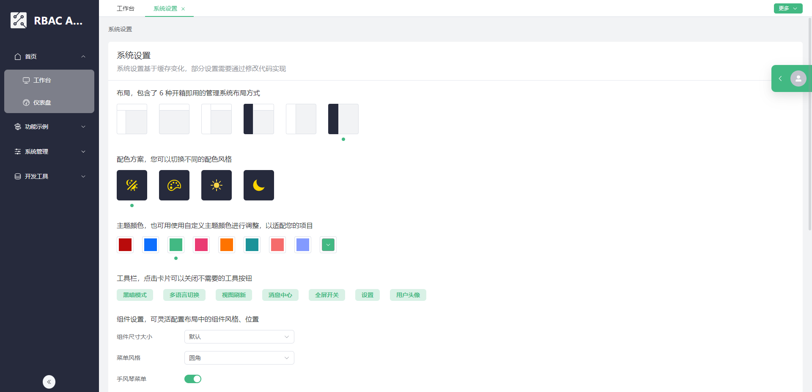
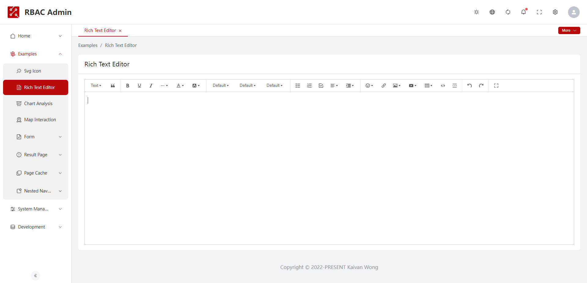
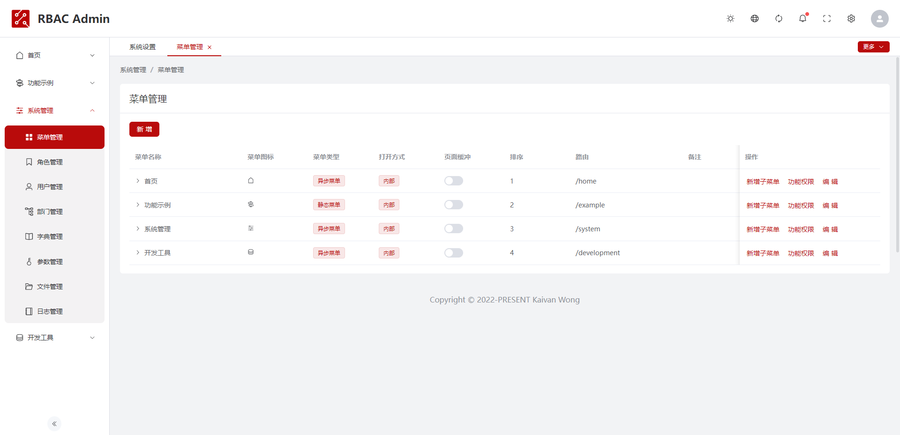
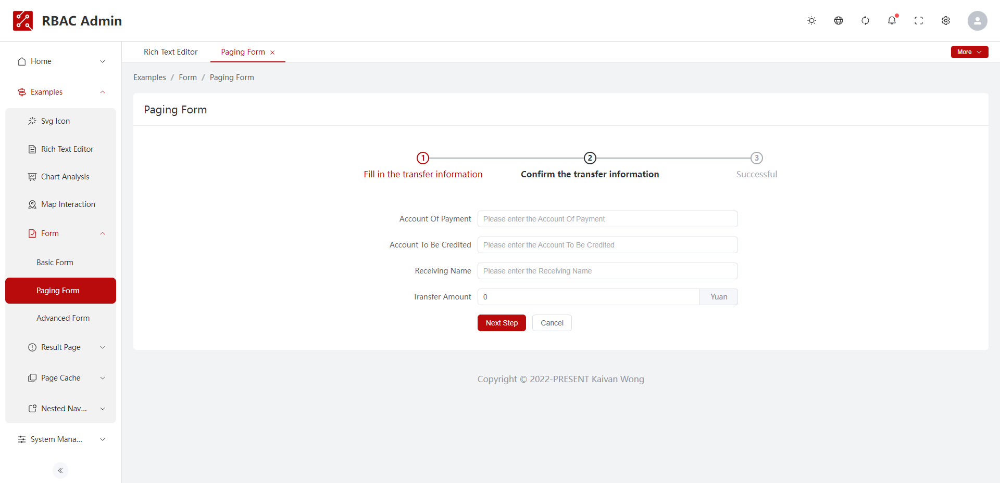

# 🚀🚀🚀 RBAC Admin Web

中后台权限管理系统 - Web 前端，基于 Vuejs + Element Plus 构建，集成国际化多语言、多主题多布局、状态管理、自动导入、接口 Mock 等功能，提供常用的静态页面模板

源码: [wingscloud/rbac-admin-web](https://github.com/wingscloud/rbac-admin-web)

演示地址: [https://rbac-admin.netlify.app](https://rbac-admin.netlify.app)

<table>
	<tr>
    <td colspan="2"> </td>
  </tr>
  <tr>
    <td></td>
  </tr>
  <tr>
    <td></td>
  </tr>
  <tr>
    <td></td>
  </tr>
  <tr>
    <td></td>
  </tr>
  <tr>
    <td></td>
  </tr>
  <tr>
    <td></td>
  </tr>
  <tr>
    <td></td>
  </tr>
  <tr>
    <td></td>
  </tr>
</table>

## 特性

**💡 最新技术栈** - 基于 Vue3、Vite、TypeScript、Element Plus、Axios、Pinia、Unocss 等最新技术栈构建；

**🚀 工程化开发** - 集成 Eslint + Stylelint + Prettier，提供基于 Vite 的工程化配置，合理的代码目录及代码注释；

**🎨 开箱即用** - 提供多种开箱即用的管理系统页面模板，支持丰富的布局与主题，同时保证多端的良好适配性；

**🌐 国际化** - 基于 Vue-i18n 的国际化多语言解决方案，搭配 i18N Ally IDE 插件，实现多语言项目的高效开发；

**🔑 权限验证** - 提供完整的、精确到按钮级的细颗粒度权限验证功能，搭配用户角色管理，适应多数业务场景；

**📦 丰富的组件** - 二次封装了常用的三方组件，如：上传、富文本编辑器、地图、图表等，提供代码生成工具；

**🕹️ 接口模拟** - 使用 Mockjs 作为接口数据的模拟，体验项目完整功能，根据预留接口快速对接服务应用程序；

**🎯 内置函数** - 内置开发常用的工具函数及钩子函数，如：自动导入、网络请求、缓存、增删改查、状态管理等；

## 开始

通过 Github Clone 代码，或者 fork 该仓库

```shell
git clone https://github.com/wingscloud/rbac-admin-web.git
```

安装依赖包

```shell
npm install # 您也可以使用 yarn 或者 pnpm
```

开发模式

```shell
npm run serve # 支持搭配环境变量使用，如 npm run serve:stag
```

构建包

```shell
npm run build # 支持搭配环境变量使用，如 npm run build:stag
```

本地预览构建包

```shell
npm run build # 先进行本地构建

npm run preview # 使用本地构建包运行 preview 命令，同样可搭配环境变量使用
```

其他命令

```shell
npm run format:prettier # 使用 Prettier 进行代码格式化

npm run lint:stylelint # 使用 Stylelint 检查 style 规范

npm run lint:eslint #  运行 Eslint 语法检测

npm run lint:eslint:fix # 基于 Eslint 的语法自动修复
```

## IDE 插件

为了使用本项目完整的功能，如 i18n Ally、Prettier 等，务必在您的 IDE 安装以下插件。

如果你使用 VSCode 打开项目，只需要遵循工作空间的安装建议即可。您可用在项目的 `.vsocde/` 目录下看到插件的建议列表、插件配置 json，您可用根据需要进行调整。

<table>
  <tr>
    <td></td>
    <td></td>
    <td></td>
    <td></td>
    <td></td>
    <td></td>
  </tr>
</table>

### 开源协议

[MIT licensed](./LICENSE) © 2022 [Kaivan Wong](https://github.com/kaivanwong)
